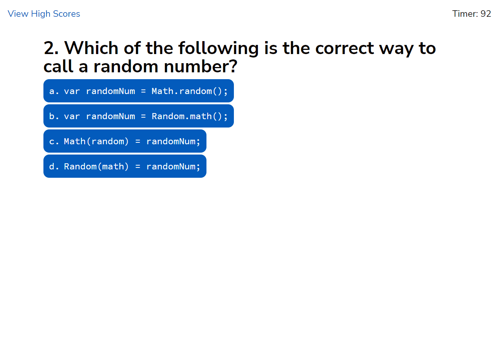

# Code Quiz 
This JavaScript Coding Quiz starts as soon as the user clicks the "Start Quiz" button. There are ten multiple choice questions. The answers are logged when the user clicks, so at the end of the game, they are able to see which questions they got right or wrong. The user can save their score to the high scores page with initials up to three characters in length. (High scores are saved only in localStorage.)\
During the quiz, the timer counts down starting at an avarage of 10 seconds per question. If an answer is wrong, 10 seconds are subtracted from the counter. However, if an answer is correct, the user gains 10 points. Any remaining seconds at the end of the game are counted as points toward the final score. If the timer runs out, the quiz is over, reglardless of how many questions were

# View Live Page
[View the live JavaScript Code Quiz page on GitHub.](https://jcolecodes.github.io/code-quiz-challenge-04/)

# Screenshot
